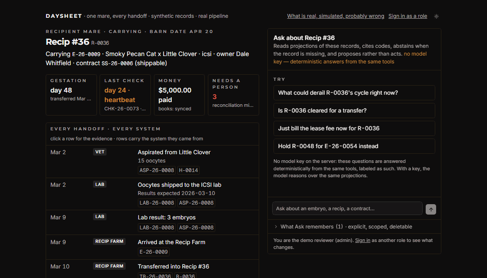

# Daysheet

**An unofficial candidate build.** Synthetic data. Real behavior.

|                                       |                                                                                                                                                                                                                                                                    |
| ------------------------------------- | ------------------------------------------------------------------------------------------------------------------------------------------------------------------------------------------------------------------------------------------------------------------ |
| **What is this?**                     | A working prototype of an operations backend for a performance-horse breeding business, with a Next.js harness on top: one mare's season, one sold lot's settlement, a board of what needs a person, and a read-only assistant that says what it doesn't know.     |
| **Why was it built?**                 | To answer one question for a Senior Full-Stack (AI-first) role: _what if the systems the operation already relies on became easier to trust, observe and ask questions of?_ — not to replace them. Built by one candidate, unsolicited, from public material only. |
| **What is fact, what is assumption?** | Facts about the operation come from its public pages and are cited in [docs/research](docs/research). Everything else is labeled HYPOTHESIS or ASSUMPTION in [docs/ASSUMPTIONS.md](docs/ASSUMPTIONS.md). The product never promotes one to the other.              |
| **What is synthetic?**                | Every horse, person, contract, phone number and dollar. No portal, login, admin page or customer record was accessed. Not affiliated with, endorsed by, or connected to any company.                                                                               |
| **What works right now?**             | The whole thing, offline: Stripe in test mode or a labeled simulator down the same inbox; QuickBooks sandbox or a simulator with fault injection; the assistant with a key or a deterministic offline answerer over the same tools. Every screen says which.       |
| **How do I run it?**                  | `docker compose --profile app up --build`, then `http://localhost:3100`. Or see [Run it](#run-it) for the local path. `pnpm demo:reset` restores the seed.                                                                                                         |
| **How do I validate it?**             | `pnpm verify` (lint, typecheck, every test suite, builds), `pnpm test:e2e` (Playwright, the ninety-second journey included), `pnpm audit --prod`, `pnpm check:copy`. CI runs all of it on every push.                                                              |

The front doors are **`/story`** and **`/settlement`** and need no sign-in · **`/build`** says what is real, simulated and probably wrong · demo logins on the sign-in page, one click per role · dark by default, light one click away.



## The ninety seconds

1. **The ring.** The landing's ring is the board: four live signals, each a real exception with its system state, what it means, who acts next — and what it holds up, in dollars, read from the records. The landing sums it: "$31,398.00 waits on them." Click one — it has its own address, Back returns, refresh keeps it. Ask _What is at stake today?_ and get the same board, largest first.
2. **Settlement.** A sold lot from the hammer to the papers. _Why?_ asks the assistant, which answers from the same records with the codes. **Settle the ACH** (a simulated Stripe delivery, down the real path): the rule runs, the papers become _eligible, not released_ — a person releases them, by name.
3. **Break it.** Deliver the webhook again: counted, not applied. Record an ACH return: the ledger moves one way, the papers are held again, and if they had already gone out the board says so in red — software cannot recall a document.
4. **The boundary.** Ask for the buyer's card number: refused in code, before any model, with what is available instead.

One Playwright test walks exactly this path and asserts the console stayed clean: [apps/web/e2e/journey.spec.ts](apps/web/e2e/journey.spec.ts).

## The order of trust

|                   | What it means here                                                                                                                                                                                                                           | Where to see it                                  |
| ----------------- | -------------------------------------------------------------------------------------------------------------------------------------------------------------------------------------------------------------------------------------------- | ------------------------------------------------ |
| **Truth**         | Append-only audit rows in the same transaction as the change; codes from an atomic sequence; integer cents; known business rules in deterministic code, never in a model                                                                     | any record page → audit trail; `packages/domain` |
| **Reliability**   | Transactional outbox → idempotent consumers; a durable job ledger with dead letters that become a person's problem; a circuit breaker per dependency; per-endpoint rate limits; a cache invalidated by events, with TTL only as a safety net | **Reliability Lab**                              |
| **Observability** | One correlation id from the click to the books, on every log line, audit row, job and Sentry event; a trace endpoint; an **Operations** board where every source's failure lands in one shape                                                | Operations, Architecture, any error toast        |
| **AI**            | An assistant over projections, not tables, behind a policy layer; every answer cites codes, records its prompt and tool versions and the state it saw, and is served from cache only against that same state                                 | Ask (⌘J), Evals                                  |

## The front door

| Route                     | What it shows                                                                                                                                                                                                                                                                                                                                                                                                                                                                                                                                                                                                                                                                                                                                                                                                                                                                                                                                                                  |
| ------------------------- | ------------------------------------------------------------------------------------------------------------------------------------------------------------------------------------------------------------------------------------------------------------------------------------------------------------------------------------------------------------------------------------------------------------------------------------------------------------------------------------------------------------------------------------------------------------------------------------------------------------------------------------------------------------------------------------------------------------------------------------------------------------------------------------------------------------------------------------------------------------------------------------------------------------------------------------------------------------------------------ |
| **`/story`**              | One recipient mare, every handoff across every system on one timeline — set-up, clearances, the transfer, the 14-day check, the day-24 heartbeat that issues the lease fee, the ACH that settled it, Stripe's delivery, the books — each row with the system it came from, the records that prove it and a correlation id. Three exceptions interleaved where they happened: a payment the books cannot reconcile, a recipient held for two embryos, an overdue check. Click a row for the rule that fired. Two failure controls on the rows they affect: **Deliver the webhook again** (counters move, the payment count does not) and **Make QuickBooks unavailable** (the sync parks, nothing is lost, it restores itself). The assistant beside it, grounded on the same records                                                                                                                                                                                           |
| **The vet, on the story** | The overdue day-45 check is recorded on the row where the exception sits, as the vet; the milestone rule decides the money — _Invoiced INV-… · ICSI stallion fee_ or _Nothing billed_ — and the exception closes itself                                                                                                                                                                                                                                                                                                                                                                                                                                                                                                                                                                                                                                                                                                                                                        |
| **Ask, on the story**     | _Is she cleared for a transfer?_ — the rule's verdict and an abstention naming veterinary review. _Just bill the lease fee_ — refused before the model, with the milestone rule explained. An instruction hidden in a question — treated as data. _Hold R-0050 for E-26-0054 instead_ — a proposal card; a person approves; the rule runs again at approval and may still refuse                                                                                                                                                                                                                                                                                                                                                                                                                                                                                                                                                                                               |
| **`/settlement`**         | One sold lot from the hammer to the papers, as three systems see it: the ledger's payment row, the payment provider's latest event, the registration document — and the books. The sale's own order on one strip: winning bid → invoice → ACH initiated → settlement pending → **papers held** → ACH cleared → accounting sync → papers release eligible → released _by a person_. The rule is the sale's published condition (`RegistrationReleasePolicy v1`: an initiated debit is not cleared funds). **Settle the ACH** is a simulated Stripe delivery down the real inbox path and says so on the button; **Release the papers** is a person's click, audited by name, refused by the rule if the money has not cleared; **Deliver a late "processing" event** makes the ledger and Stripe disagree — the detector raises it, and Ask abstains: _billing review is required_. Every exception on the page and on the board shows **system state** and **what this means** |
| **`/build`**              | The honesty page, now a readout first: build health (API, Postgres, Redis, BullMQ, Stripe, QuickBooks, the review graph and whether its checkpoints are durable), the last verify run's counts (`pnpm verify:report` writes them; nothing is shown that did not run), the last event, the last trace — with **Open trace**, **Replay event** and **Run evals** — then real vs simulated, where this sits in an estate that already runs, when fine-tuning would be right and why not now, non-goals, the eval set, how AI was used, every decision in one line, and "This is a hypothesis. Tell me where I am wrong."                                                                                                                                                                                                                                                                                                                                                          |
| **`/vision`**             | How the assistant earns autonomy — Observe → Shadow → Assist → Propose → Execute — with this build on Propose for one controlled kind, the count of real decisions under it, and a gate on every stage to the right; then three doors that already run (ask across the estate, the customer update a person sends, replay by correlation id) and six hypotheses on the same architecture, each labelled as one                                                                                                                                                                                                                                                                                                                                                                                                                                                                                                                                                                 |
| **A client's door**       | A customer signs in to her own record — embryos, contracts, invoices, horses, the owner update — never the barn's counters; Ask answers _Where are my embryos right now?_, _What do I still owe?_ and _When does board start?_ from that record alone, with a key or without                                                                                                                                                                                                                                                                                                                                                                                                                                                                                                                                                                                                                                                                                                   |
| **The ring and the dock** | The landing's ring is the board — four live signals (sale, recipient return, reproduction, accounting), each a real exception with its id, its system state, what it means, who acts next, and one door to the page where they act; the dock in the corner carries the same list to every page, and "Ask about this" hands the assistant the signal's question                                                                                                                                                                                                                                                                                                                                                                                                                                                                                                                                                                                                                 |

## The surfaces behind it

| Surface             | What it does                                                                                                                                                                                                                                                                                                                                                                                                                                                                                                                                                                                                                                                        |
| ------------------- | ------------------------------------------------------------------------------------------------------------------------------------------------------------------------------------------------------------------------------------------------------------------------------------------------------------------------------------------------------------------------------------------------------------------------------------------------------------------------------------------------------------------------------------------------------------------------------------------------------------------------------------------------------------------- |
| **Operations**      | Opens on the morning brief: what needs a person first (severity, dollars held up, age), what was raised and resolved since yesterday's snapshot, what the audit trail recorded since then, and the next two days as the rules see them. Beneath it, "N things require attention" — a projection of unresolved `OperationalException`s from every source: a dead job, a webhook that would not apply, books that disagree, an embryo arriving with no recip set aside, an overdue check, a held order on a collection day, an unconfirmed text, two checks that disagree. Acknowledge, retry, resolve, ignore, inspect the trace (drawn on a time axis); all audited |
| **Decisions**       | The decision ledger: every act the assistant prepared (a hold, a veterinary confirmation request), shown as a diff a person approves, edits or rejects; approval re-reads the records and refuses as stale when they moved; each decision's page answers why, what it knew, what changed, who decided, what came of it — from rows that already exist                                                                                                                                                                                                                                                                                                               |
| **Runs**            | The flight recorder: every answer with where its time went — the policy gate, authorization, each tool with the records it returned, the model, the verifier — measured by the review graph as it ran and stored with the answer                                                                                                                                                                                                                                                                                                                                                                                                                                    |
| **Reliability Lab** | Six controls, each driving the real pipeline: send the same Stripe webhook three times · make QuickBooks answer 429 twice · take QuickBooks down (circuit opens, jobs park, restore, probe, close, drain) · kill the worker (jobs wait in the ledger, restart, zero lost) · poison a cached record (see the stale read, then the event that heals it) · record a check that contradicts another (the detector raises it). A live feed of the platform bus beside it. The failures are simulated and labeled as such; the pipeline they run through — the inbox, the ledger, the retries, the breaker, the rules, the audit rows, the recovery — is the real one     |
| **Architecture**    | The running system describing itself: contexts, the consumer registry, queue and outbox state, breakers, cache hit ratio, recent jobs and events, the assistant's permissions — live                                                                                                                                                                                                                                                                                                                                                                                                                                                                                |
| **Day Sheet**       | Collection-day manifest (ship / hold with the reason) and transfer-day manifest (embryos expected, checks due, milestones crossing today)                                                                                                                                                                                                                                                                                                                                                                                                                                                                                                                           |
| **Records**         | One page per embryo, contract, horse, customer with a cited timeline and the append-only audit trail                                                                                                                                                                                                                                                                                                                                                                                                                                                                                                                                                                |
| **Intake**          | Inbound text → parsed fields → a person confirms → the reply carries the embryo IDs                                                                                                                                                                                                                                                                                                                                                                                                                                                                                                                                                                                 |
| **Money**           | One row per invoice with one mark per system (ledger · Stripe · books) and a per-invoice timeline of every step; Stripe (cards + ACH, refunds, idempotent webhooks, replay) ↔ accounting sync with reconciliation and human-resolved discrepancies                                                                                                                                                                                                                                                                                                                                                                                                                  |
| **Ask**             | The read-only assistant, inside ⌘K: type a code and jump to the record, type a question and it answers in the same surface with evidence chips, abstentions, conflicts, "Send to team"; ⌘J opens it directly; feedback becomes eval cases; memory is explicit and editable                                                                                                                                                                                                                                                                                                                                                                                          |

## Stack

TypeScript · React · Next.js 16 · Tailwind 4 · NestJS 11 · PostgreSQL 17 · Prisma 7 · Redis 7 + BullMQ · Stripe · QuickBooks Online (Intuit OAuth) · Anthropic SDK · Vitest + Jest + Playwright · Sentry.

```
apps/api/src/platform     config · persistence · security · audit · codes · clock · events (outbox, dispatcher)
                          queue (ledger + BullMQ) · resilience (breakers, rate limits) · cache · observability · messaging
apps/api/src/modules      reproduction · veterinary · billing · accounting · operations · ask · lab   (bounded contexts)
apps/web                  Next.js harness — sessions, server components, the Ask sheet, the lab, the board, SSE live refresh
packages/domain           Framework-free rules with tests
packages/db               Prisma schema, migrations (append-only guards, the platform tables), deterministic seed
docs                      research (A–I), assumptions, decisions (ADR-001…018), security, the AI build ledger
```

## The vendor boundary, the review graph, the whole stack

- A lot sold on the sale platform enters through the same write-once inbox as a Stripe event and is translated by `AuctionAdapter` into the sale's own words (`SaleLot`, a settlement invoice, a certificate to hold). The payload is invented (A16); a real feed replaces one schema. ADR-021.
- The assistant runs through one LangGraph, `ExceptionReviewGraph`: gate → authorize → compose → verify → persist → pause for a person when a proposal was made → record the decision. Checkpoints in Postgres; the decision is a domain event that resumes the thread. The graph orchestrates and never decides. ADR-022.
- `docker compose --profile app up --build` runs web, api, worker, Postgres and Redis. `deploy/kubernetes/README.md` says when a cluster would be earned, and why not yet.

## Run it

Requirements: Node 22+, pnpm 12, PostgreSQL 17. `docker compose up -d` provides Postgres (5433) and Redis 7 (6380) if you have neither. Redis is optional — without it jobs run inline in the same durable ledger and `/health` says so; with it, BullMQ workers run them and the lab's "kill the worker" pauses real queues.

```bash
pnpm install
cp .env.example .env            # DATABASE_URL, AUTH_SECRET; everything else is optional, no secrets inside
pnpm --filter @daysheet/domain build
pnpm --filter @daysheet/db build
pnpm db:migrate                 # applies migrations to DATABASE_URL
pnpm db:seed                    # the synthetic world for 2026-04-20
pnpm dev                        # web on :3100, api on :3101 (+ /docs Swagger)
pnpm demo:reset                 # later: drop, migrate and reseed — the demo starts over (sign in again afterwards)
```

Open `http://localhost:3100/story` or `http://localhost:3100/settlement` — no sign-in. One click on the login page signs you in as any of the six roles (password `daysheet-demo`).

Or the whole stack in containers, nothing else installed:

```bash
docker compose --profile app up --build
```

then `http://localhost:3100`. The api migrates and seeds an empty database on start; the worker owns the queues.

### Optional keys — each turns on a real integration; each is simulated without

| Key                                                                        | Turns on                                                                                                                                                                                                                                                                             | Without it                                                                                                                                                                |
| -------------------------------------------------------------------------- | ------------------------------------------------------------------------------------------------------------------------------------------------------------------------------------------------------------------------------------------------------------------------------------ | ------------------------------------------------------------------------------------------------------------------------------------------------------------------------- |
| `ANTHROPIC_API_KEY`                                                        | Ask and the eval suite (`claude-opus-5`; judge `claude-haiku-4-5`)                                                                                                                                                                                                                   | A local Ollama model, if one is running (below); else Ask answers with a labeled offline abstention; the policy layer still answers money/clinical/mutation questions     |
| nothing — `ollama pull qwen2.5:7b-instruct`                                | Ask and the eval suite on a local model, free: tool calls, then one answer constrained to the schema. `ASK_PROVIDER=auto` finds it; `OLLAMA_URL` / `OLLAMA_MODEL` point elsewhere                                                                                                    | The same offline answerer. The policy gate, the projections and the verifier are the same code whichever model answers                                                    |
| `OPENAI_COMPAT_BASE_URL` + `OPENAI_COMPAT_API_KEY` + `OPENAI_COMPAT_MODEL` | A hosted model behind an OpenAI-style endpoint — a free tier on Groq, OpenRouter or Google's compatibility endpoint, or Ollama's own `/v1` on another machine. `auto` prefers it over the local model; the eval suite (`pnpm --filter api eval`) is how to choose between candidates | The local model, or offline                                                                                                                                               |
| `STRIPE_SECRET_KEY` + `STRIPE_WEBHOOK_SECRET` (test mode)                  | Hosted invoices (card + ACH test accounts), real webhooks via `stripe listen --forward-to 127.0.0.1:3101/integrations/stripe/webhook`, replay via `stripe events resend evt_…`                                                                                                       | The simulator feeds the same inbox and job; the lab's duplicate-webhook control proves redelivery is harmless                                                             |
| `QBO_CLIENT_ID` + `QBO_CLIENT_SECRET` (sandbox)                            | OAuth at `/integrations/qbo/connect`, customer/invoice/payment/credit sync with `minorversion=75`, 429 back-off, stale SyncToken handling                                                                                                                                            | A durable simulator with fault injection (`429x2`, `500x1`, `outage`, `stale:INV-…`, `dupname`) and a "tamper the books" control. The lab runs only against the simulator |
| `TWILIO_*` (test credentials)                                              | Signed inbound webhook, real outbound texts, STOP/HELP                                                                                                                                                                                                                               | Inbound via the "Text the line" form; outbound logged as sent                                                                                                             |
| `RESEND_API_KEY`                                                           | Owner digest by e-mail                                                                                                                                                                                                                                                               | Logged as sent                                                                                                                                                            |
| `SENTRY_DSN`                                                               | Error tracking in both apps, tagged with the correlation id                                                                                                                                                                                                                          | No-op                                                                                                                                                                     |

## Verify it

```bash
pnpm verify                     # lint + typecheck + unit/integration tests + builds, every package
pnpm verify:report              # the same, and writes the counts /build shows (nothing is shown that did not run)
pnpm film                       # records the front door driving itself (Playwright, ~60 s) into apps/web/public/film — the landing's film section
                                # the front door's threshold is WebGL (three + react-three-fiber); ?scene=drawn shows the SVG fallback, ?scene=3d&quality=full forces the built one
                                # the mare is a CC0 model (Quaternius, public domain) — apps/web/public/models/horse.LICENSE.txt; nothing on the site is any operation's asset
pnpm test:e2e                   # Playwright against a running stack (desktop + phone): the journey, the story, the lab, every role
                                # start the API with ASK_PROVIDER=offline (or a key): the suite waits 20 s for an answer, and a small local model takes longer
                                # the journeys change the demo world (a request is prepared and approved): reseed and restart the API before a run, and before the film
pnpm audit --prod               # production dependencies against the advisory database
pnpm check:licenses             # production dependency license allowlist
pnpm check:copy                 # product copy: no word that says nothing
pnpm eval                       # runs the Ask eval cases through the running API (needs a key; spends money)
```

The API's integration tests run against a sibling database (`<name>_test` next to `DATABASE_URL`, or `TEST_DATABASE_URL`), created and migrated on first run and reseeded before every run, so a run starts from the seed and not from the last run's leftovers; the demo database is never written by a test.

What the tests prove: a redelivered Stripe event yields one payment; an ACH payment moves processing → succeeded on the same row and never regresses; a returned ACH debit never clears again and a second return is refused with a domain code; papers released before a return become a critical exception, because software cannot recall a document; an instruction inside a retrieved record is data — nothing is marked paid, nothing is refunded; memory takes preferences and refuses facts, money and policy; a settled balance flips a contract to shippable through a domain event and releases held orders with an audit row; an event appended in a transaction is consumed exactly once even when published twice; a consumer that throws rolls back its processed row and the next delivery tries again; a job that exhausts its attempts becomes an exception a person can retry, and recovery closes it; the breaker opens at the threshold, half-opens after the cooldown and closes on a probe; the policy layer abstains on money, mutation and clinical questions without calling the model; a customer cannot open another customer's records through any entry point the assistant uses; an answer citing a code the tools never returned is downgraded to an abstention; the four front-door questions pass the same deterministic grader the eval suite uses, without a model; a cached record reads exactly like a fresh one (the cache is JSON in memory and in Redis alike).

## Deploy it, free

Vercel for the web, Render for the API (one process, no Redis: jobs inline from the ledger), Neon for Postgres — three
free tiers, no card, the same image and migrations `docker compose` runs. `render.yaml` and
`apps/web/vercel.json` carry what the platforms can read; [`docs/DEPLOY.md`](docs/DEPLOY.md) is
the runbook: the order, the one shared secret, what each free tier changes (a sleeping instance,
a suspending database), which keys make which integration live, and how to reset the world.

## The three-minute walkthrough

1. Open the deployed URL → **See one mare's story**. Read the header: who she is carrying, day 48, the heartbeat recorded, the lease fee paid, three things that need a person.
2. Click the row _is written down for Recip #37, but … she cannot be held for …_. The drawer: the rule (`RECIPIENT_CARRYING`), the source records, the trace.
3. On the Stripe row, **Deliver the webhook again**: deliveries 2 · rejected as duplicate 1 · payments for this invoice 1.
4. On the billing row, **Make QuickBooks unavailable**: the sync job parks, "lost 0". **Restore QuickBooks**: the probe closes the circuit and it drains. The exception it raised resolves itself with the reason.
5. Ask, beside the timeline: _Is R-0037 cleared for a transfer?_ → the rule's verdict and "Veterinary review is required." _Just bill the lease fee now_ → refused, with the heartbeat rule. _Hold R-0050 for E-26-0054 instead_ → a proposal card; **Approve** → the rule runs, the record changes, the conflict on the board resolves.
6. **`/build`**: what is real, what is simulated, what is probably wrong — and the eval set the assistant is graded on.

For engineers, sign in as admin: the **Reliability Lab** (six controls against the real pipeline), **Operations**, **Architecture**, **Evals**.

## Honesty about the AI

Ask is a Claude model behind typed, read-only tools that return projections. It cannot write to anything. The system prompt, tool definitions, policy layer and the deterministic verifier are in [apps/api/src/modules/ask](apps/api/src/modules/ask). Its spend is capped per month. This repository was built with Claude Code as a primary tool; what it wrote, what was rejected, and what was corrected is in [docs/AI_BUILD_LEDGER.md](docs/AI_BUILD_LEDGER.md).

## What is deliberately unfinished

The mobile app, the auction platform, live-foal-guarantee terms, the vet price list, foaling and registration paperwork, incentives. Each is a real thing the operation does; none is claimed here. Multi-instance breaker state, OpenTelemetry export and a message log beyond one Postgres table are named in the decisions as the next steps, not built.

## Docs

[Contributing](CONTRIBUTING.md) · [Architecture](docs/ARCHITECTURE.md) · [Decisions](docs/decisions) · [Assumptions](docs/ASSUMPTIONS.md) · [Domain](docs/DOMAIN.md) · [Security](docs/SECURITY.md) · [Deploy](docs/DEPLOY.md) · [Research](docs/RESEARCH.md) · [AI build ledger](docs/AI_BUILD_LEDGER.md) · [Third-party notices](THIRD_PARTY_NOTICES.md)

## License

MIT for the code (© 2026 Pavan Kalyan Ghanta). No trademark, name, logo, photograph or record of any real business is included or licensed.
